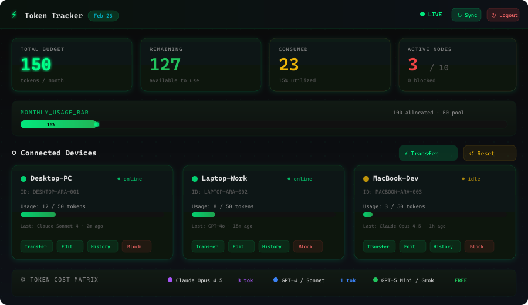
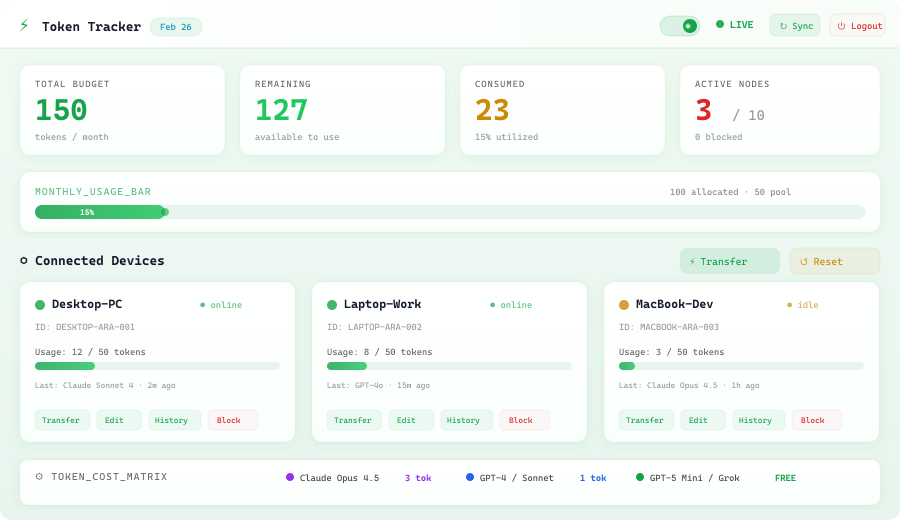
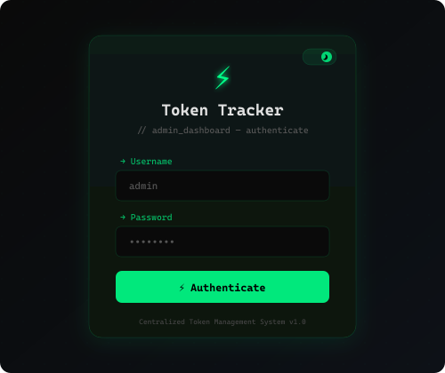
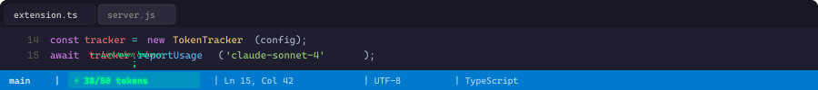
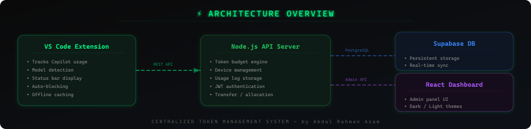

<p align="center">
  
</p>

<h1 align="center">⚡ Token Tracker — Centralized Copilot Usage Manager</h1>

<p align="center">
  <a href="https://marketplace.visualstudio.com/items?itemName=Abdul-Rahman-Azam.token-tracker-extension"></a>
  
  
  
</p>

<p align="center">
  <b>Track, limit & manage GitHub Copilot token usage across all your devices.</b><br/>
  <sub>By <strong>Abdul Rahman Azam</strong></sub>
</p>

---

## 📁 Project Structure

```
├── backend/          → Node.js API server (Express + Supabase)
├── dashboard/        → React admin dashboard (Vite + dark/light themes)
├── extension/        → VS Code extension (TypeScript)
└── docs/             → Setup & integration guides
```

---

## 🎯 What It Does

- **Tracks** every GitHub Copilot interaction (chat, inline completions, commands)
- **Enforces** monthly token budgets per device with auto-blocking
- **Manages** multi-device allocations from a central admin dashboard
- **Supports** model-aware pricing (Claude Opus 4.5 = 3 tokens, standard = 1, free = 0)

---

## 🖥️ Screenshots

### Dashboard — Dark Mode
<p align="center">
  
</p>

### Dashboard — Light Mode
<p align="center">
  
</p>

### Login & Status Bar
<p align="center">
  
  &nbsp;&nbsp;
  
</p>

---

## 🏗️ Architecture

<p align="center">
  
</p>

---

## 🚀 Quick Start

### 1. Backend (API Server)
```bash
cd backend
npm install
cp .env.example .env    # Fill in Supabase keys
node server.js
```

### 2. Dashboard (Admin Panel)
```bash
cd dashboard
npm install
npm run dev             # Opens at http://localhost:5173
```

### 3. Extension (VS Code)
- Install from [VS Code Marketplace](https://marketplace.visualstudio.com/items?itemName=Abdul-Rahman-Azam.token-tracker-extension)
- Or: `cd extension && npm run package` → Install the `.vsix` file

---

## 🏷️ Token Cost Matrix

| Model | Cost |
|-------|------|
| 🟣 Claude Opus 4.5 | **3 tokens** |
| 🔵 GPT-4 / Claude Sonnet / Others | **1 token** |
| 🟢 GPT-5 Mini / Grok Code Fast | **FREE** |

---

## 📦 Tech Stack

| Component | Technologies |
|-----------|-------------|
| **Backend** | Node.js · Express · JWT · Supabase (PostgreSQL) |
| **Dashboard** | React 18 · Vite · CSS Custom Properties · Dark/Light themes |
| **Extension** | TypeScript · VS Code API · Offline caching |

---

## 📄 Documentation

- [Integration Guide](docs/INTEGRATION.md) — API endpoints & device registration
- [Network Setup](docs/NETWORK_SETUP.md) — Multi-device LAN configuration

---

## 👨‍💻 Author

**Abdul Rahman Azam**

---

<p align="center">
  <sub>⚡ Token Tracker · Centralized Copilot Usage Management · MIT License</sub>
</p>
